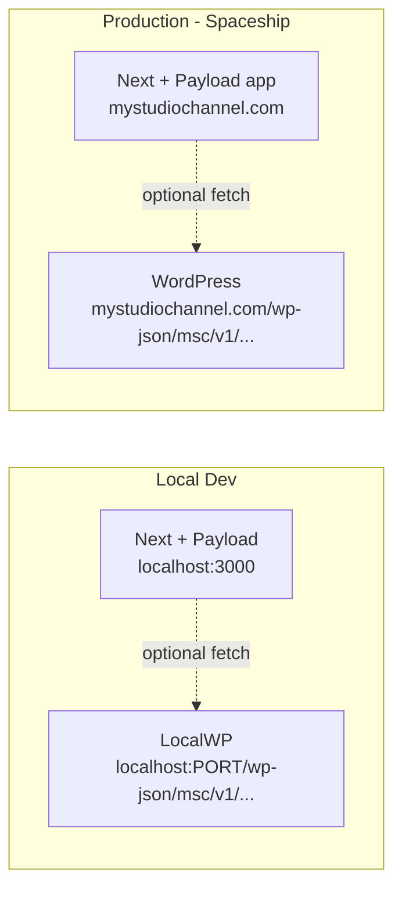

# Headless WordPress Backend — optional integration plan

**Phase note (2026):** **`msc-new` has completed the move** from a static-export style workflow to a **full Next.js + Payload** application. **Booking, leads, hero, and Media** are implemented in Payload with static files in **`public/media`** (**`/media/...`** URLs). The flows below describe a **possible WordPress plugin** layer if you want **WP** to own some endpoints or content **in addition to** Payload — not a replacement for the current bundle.

## Architecture (if you add WP endpoints later)



**If implemented:** dynamic data would use browser or server `fetch` to WP where you wire it. **Core MSC** remains **`next build` + `.next` deploy** with **`/media/`** for images — not an **`out/`**-only static tree.

---

## What gets built

### A -- WordPress custom API plugin (PHP)

New file: `wp-content/plugins/msc-api/msc-api.php` (added to both LocalWP and Spaceship WP).

Three endpoints registered under `msc/v1`:

- `POST /wp-json/msc/v1/booking-request` -- saves booking to a custom post type `msc_booking`; triggers `wp_mail` confirmation to admin.
- `GET /wp-json/msc/v1/booking-availability?date=YYYY-MM-DD` -- returns booked slots for a date so the calendar knows what to grey out.
- `POST /wp-json/msc/v1/signup` -- saves an email + name to a custom post type `msc_lead`; optionally triggers a welcome email.

Security: public POSTs protected by a shared secret header (`X-MSC-Key`) checked against a WP option. No nonce needed for browser-to-WP calls. All functions prefixed `msc_` per project rules.

### B -- Next.js lib files (TypeScript) — only if wiring this WP track

- [`lib/booking.ts`](lib/booking.ts) — today often points at **Payload** (`NEXT_PUBLIC_MSC_BOOKING_URL=payload`); this plan describes an **alternate** `fetch` POST to WP when you set URLs to **`wp-json`** instead.
- `lib/signup.ts` -- new file, `submitSignup({ email, name })` POSTs to `NEXT_PUBLIC_MSC_SIGNUP_URL`.
- `lib/cms.ts` -- new file, fetch functions that pull CMS content from WP REST + ACF at build time (hero slides, show cards, testimonials). Falls back to the current hardcoded values if the API is unreachable.

### C -- Environment variables

`.env.local` (local, never committed):
```
NEXT_PUBLIC_MSC_BOOKING_URL=http://localhost:PORT/wp-json/msc/v1/booking-request
NEXT_PUBLIC_MSC_SIGNUP_URL=http://localhost:PORT/wp-json/msc/v1/signup
NEXT_PUBLIC_MSC_API_URL=http://localhost:PORT/wp-json/msc/v1
MSC_API_KEY=your-local-secret
```

`.env.production` (Spaceship / CI):
```
NEXT_PUBLIC_MSC_BOOKING_URL=https://mystudiochannel.com/wp-json/msc/v1/booking-request
NEXT_PUBLIC_MSC_SIGNUP_URL=https://mystudiochannel.com/wp-json/msc/v1/signup
NEXT_PUBLIC_MSC_API_URL=https://mystudiochannel.com/wp-json/msc/v1
MSC_API_KEY=your-live-secret
```

### D -- WordPress ACF content (optional Phase 2)

ACF field groups for: Hero Slides, Show Cards, Testimonials, Process Steps. Exported as JSON and committed to repo. Next.js `lib/cms.ts` fetches via `/wp-json/acf/v3/options/...` at build time. Components receive data as props instead of hardcoded arrays.

---

## Phased delivery (WordPress track — optional; Payload is Phase-complete for MSC)

**Current MSC (done):** Payload admin, **`/api`**, **`public/media`**, **`npm run media:sync`** — see **Site-Plans.md** and **Development.md**.

**WP Phase 1 — booking + signup via WordPress (only if you choose this path)**
1. Build and install the WordPress plugin on LocalWP.
2. Wire `lib/booking.ts` / forms to the WP endpoints **or** keep Payload as source of truth and use WP for parallel experiments (avoid double-writes unless designed).
3. Test locally end-to-end against WP if enabled.
4. Deploy plugin to Spaceship WP, update `.env` to point at live URL, **`npm run build`** + **`pushitup -- .next`** per **Go-Live-Checklist.md**.

**WP Phase 2 — CMS-driven content from WordPress**
5. Register ACF field groups for Hero, Shows, Testimonials (WP side).
6. Write `lib/cms.ts` fetch functions with fallbacks **alongside** Payload-driven content.
7. Update components only where you intentionally dual-source from WP.
8. Rebuild and deploy **`.next`**; confirm WP-fed content appears as expected without breaking **`/media/`** assets served from Next.

---

## Files changed summary

- **New (WordPress):** `wp-content/plugins/msc-api/msc-api.php`
- **Modified:** [`lib/booking.ts`](lib/booking.ts) -- replace mock with real fetch
- **New (Next.js):** `lib/signup.ts`, `lib/cms.ts`
- **New:** `.env.local`, `.env.example`
- **Modified (Phase 2):** `components/hero-section.tsx`, `components/demos-section.tsx`, `components/testimonials-section.tsx`
- **Docs:** `Development.md`, `ReCall.md` updated after each phase
