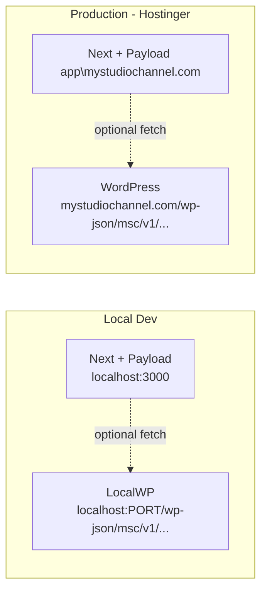

# Headless WordPress Backend — optional integration plan

**Phase note (2026):** **`MyStudioChannel` has completed the move** from a static-export style workflow to a **full Next.js + Payload** application. **Booking, leads, hero, and Media** are implemented in Payload with static files in **`public/media`** (**`/media/...`** URLs). The flows below describe a **possible WordPress plugin** layer if you want **WP** to own some endpoints or content **in addition to** Payload — not a replacement for the current bundle.

## Architecture (if you add WP endpoints later)

**If implemented:** dynamic data would use browser or server `fetch` to WP where you wire it. **Core MSC** remains **`next build` + `.next` deploy** with **`/media/`** for images — not an **`out/`**-only static tree.

---

## What gets built

| Component | Language / Path | Purpose |
|-----------|-----------------|---------|
| **WordPress API Plugin** | PHP / `wp-content/plugins/msc-api/msc-api.php` | Exposes booking/lead REST endpoints, saves to custom post types (`msc_booking`, `msc_lead`), triggers transactional mail alerts. Protected by `X-MSC-Key`. |
| **Next.js API Library** | TypeScript / `lib/booking.ts` (alt), `lib/signup.ts`, `lib/cms.ts` | Discovers available slots, submits lead and booking data, and server-side fetches ACF options for marketing blocks with local hardcoded fallbacks. |
| **Env variables** | `.env.local` / `.env.production` | Environment endpoint targets for LocalWP and Hostinger production URLs. |

---

## Phased delivery (WordPress track — optional; Payload is Phase-complete for MSC)

**Current MSC (done):** Payload admin, **`/api`**, **`public/media`**, **`npm run media:sync`** — see **START-HERE.md** and **Development.md**.

**WP Phase 1 — booking + signup via WordPress (only if you choose this path)**
1. Build and install the WordPress plugin on LocalWP.
2. Wire `lib/booking.ts` / forms to the WP endpoints **or** keep Payload as source of truth and use WP for parallel experiments (avoid double-writes unless designed).
3. Test locally end-to-end against WP if enabled.
4. Deploy plugin to Hostinger WP, update `.env` to point at live URL, **`npm run build`** + **`pushitup -- .next`** per **Go-Live-Checklist.md**.

**WP Phase 2 — CMS-driven content from WordPress**
5. Register ACF field groups for Hero, Shows, Testimonials (WP side).
6. Write `lib/cms.ts` fetch functions with fallbacks **alongside** Payload-driven content.
7. Update components only where you intentionally dual-source from WP.
8. Rebuild and deploy **`.next`**; confirm WP-fed content appears as expected without breaking **`/media/`** assets served from Next.

---

## Files changed summary

- **New (WordPress):** `wp-content/plugins/msc-api/msc-api.php`
- **Modified:** [`lib/booking.ts`](lib/booking.ts) -- replace mock with real fetch
- **New (Next.js):** `lib/signup.ts`, `lib/cms.ts`
- **New:** `.env.local`, `.env.example`
- **Modified (Phase 2):** `components/hero-section.tsx`, `components/demos-section.tsx`, `components/testimonials-section.tsx`
- **Docs:** `Development.md`, `ReCall.md` updated after each phase
