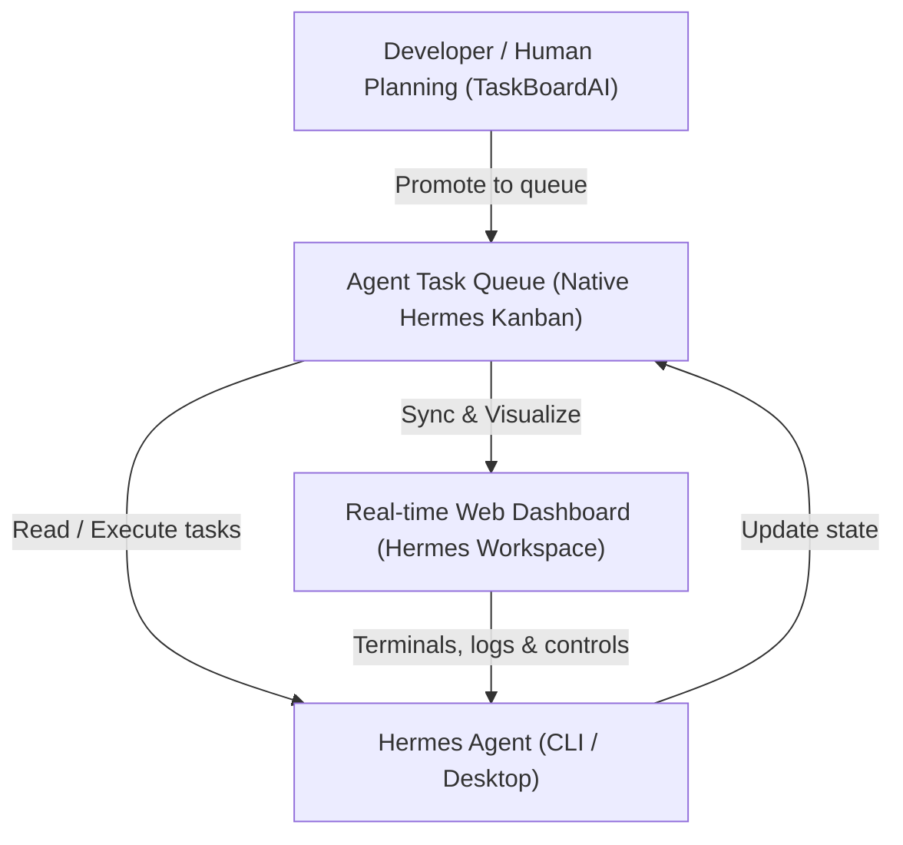

# 🪐 Hermes Agent — MyStudioChannel Master Guide & Cheat Sheet

Welcome to the **MyStudioChannel** Hermes Agent guide! This document is a complete cheat sheet for utilizing the **Hermes Agent** natively on Windows 11 within this project's ecosystem.

---

## 1. 📋 Overview

### What is Hermes Agent?
**Hermes Agent** is an advanced, terminal-optimized, tool-using AI developer agent created by **Nous Research**. It is fully capable of running local shell commands, reading and writing files, automating browsers via Playwright, and maintaining persistent session memories.

### Native Vertex AI + LiteLLM Integration
To bypass direct API-key limitations, OpenRouter markup fees, or AI Studio outages, Hermes is seamlessly bridged with your enterprise-grade **Google Cloud Vertex AI** setup using your native service account credentials.
*   **Bridge Layer:** LiteLLM proxy running locally on **port 4000**.
*   **Custom Provider:** Named `vertex-proxy` configured inside Hermes.
*   **GCP Project ID:** `wordpress-map-1492461083797`
*   **Routing Path:** Hermes CLI (`vader-3.5-flash`) ➡️ LiteLLM Proxy (`localhost:4000`) ➡️ Google Cloud Vertex AI (Gemini).

### Storage Locations
Hermes stores all of its system, configuration, session, and log files inside your local AppData folder:
*   `C:\Users\JONBEATZ\AppData\Local\hermes\`

---

## 2. ⚙️ Installation & PATH Setup

### Global Runner Details
*   **Full Executable Path:** `C:\Users\JONBEATZ\AppData\Local\hermes\hermes-agent\venv\Scripts\hermes.exe`
*   **Global CLI Command:** `hermes`

### Verification Commands
To check your installation health, run the following commands in your PowerShell console:

```powershell
# Check current version
hermes --version

# Run full health diagnostics
hermes doctor
```

---

## 3. 🛠️ Core Commands

Use these commands from your terminal to drive the Hermes Agent CLI:

| Command | Description |
| :--- | :--- |
| `hermes` | Start interactive terminal UI (TUI) chat session. |
| `hermes -z "question"` | Ask a quick, non-interactive one-off question. |
| `hermes --context HERMES.md` | Start a session pre-loading your project's custom instructions. |
| `hermes model` | Open the interactive provider and model picker menu. |
| `hermes tools` | Turn specific CLI/agent tools on or off. |
| `hermes config edit` | Open your global `config.yaml` file in your default system editor. |
| `hermes config set <key> <value>` | Set a specific configuration option directly from the CLI. |
| `hermes doctor` | Diagnose and auto-fix system or configuration inconsistencies. |
| `hermes update` | Fetch and compile the latest upstream releases from GitHub. |
| `hermes desktop` | Download, install, or launch the Hermes Desktop GUI application. |

---

## 4. 💬 TUI (Terminal User Interface) Slash Commands

When inside an interactive Hermes chat session (`hermes`), you can control the agent using these **slash commands**:

| Command | Description |
| :--- | :--- |
| `/help` | List all available system slash commands. |
| `/model <name>` | Instantly switch active LLM models (e.g., `/model vader-3.5-flash`). |
| `/reset` or `/new` | Clear current chat memory and start a completely fresh conversation. |
| `/skills` | Display all currently configured and loaded workflow skills. |
| `/skills create` | Interactively author a new reusable workflow skill. |
| `/todo` | View, add, or manage tasks on your active session checklist. |
| `/memory` | Inspect your persistent, cross-session vector memory banks. |
| `/compress` | Manually compress long chat contexts to save prompt token space. |
| `/usage` | Render high-fidelity prompt and completion token statistics. |
| `/search <query>` | Query and look up matching historical conversation transcripts. |
| `/personality <name>` | Change the agent's tone (helpful, concise, creative, pirate, catgirl). |
| `/exit` or `Ctrl+C` | Gracefully close the terminal session. |

---

## 5. 🤖 Model Switching & Selection

All model requests are securely routed via the local LiteLLM proxy:

*   **`vader-3-flash`** *(Default)* — Standard, extremely fast, and highly reliable. Ideal for quick code reviews and general questions.
*   **`vader-3-pro`** — High-capacity reasoning engine. Excellent for debugging complex logical bugs.
*   **`vader-31-pro`** — Ultimate-tier corporate agentic model. Ideal for architectural planning.
*   **`vader-3.5-flash`** — Google's latest model, equipped with advanced reasoning loops for complex refactoring tasks.

### To Switch Models Instantly:
Inside a live chat session, simply type:
```text
/model vader-3.5-flash
```

---

## 6. 🚀 Project-Specific Usage

For optimal results, **always run Hermes from your project root**:
`D:\Cursor_Projectz\MyStudioChannel`

Hermes automatically scans and loads `HERMES.md` and `TRUTH.md` from the workspace folder to align itself with project blueprints, standards, and deployment safety triggers.

### Hermes Desktop App — MSC project folder (important)

The Desktop UI has **two** folder settings that are easy to confuse:

| Setting | Where in app | What it writes | What actually drives `pwd` |
| :--- | :--- | :--- | :--- |
| **Workspace → Working Directory** | Settings → Workspace | `%LOCALAPPDATA%\hermes\config.yaml` → `terminal.cwd` | CLI / gateway config only |
| **Default project directory** | Electron `project-dir.json` | `%APPDATA%\Hermes\project-dir.json` | **Desktop backend spawn** — sets `TERMINAL_CWD` |

If `project-dir.json` is missing, Desktop falls back to **`C:\Users\JONBEATZ`** (home) even when Workspace shows the MSC path. Symptoms: `pwd` returns home, generic “Nous Research” intro instead of **`msc`** personality.

**Fix (MSC coding):**

1. Use desktop shortcut **`Hermes - MyStudioChannel`** (runs `scripts/start-hermes-desktop-msc.ps1`).
2. Or ensure `%APPDATA%\Hermes\project-dir.json` contains:
   ```json
   { "dir": "D:\\Cursor_Projectz\\MyStudioChannel" }
   ```
3. **Fully quit** Desktop (tray → Quit), reopen, then **`Ctrl+N`** new session — old sessions keep their original cwd.

**Personality:** Settings → Chat → **Msc** (maps to `display.personality: msc` + `agent.personalities.msc` in config).

**General tasks (non-MSC):** set Workspace / `project-dir.json` to **`D:\Hermes`**.

### Desktop shortcuts (Jon’s PC)

| Shortcut | Purpose |
| :--- | :--- |
| **Start-Google-API-v2** | Single-window LiteLLM + hidden ngrok (`scripts/start-google-api-desktop.ps1`) |
| **Stop-Google-API** | Full shutdown: Next **3000**, LiteLLM **4000**, ngrok, Hermes gateway (`scripts/stop-msc-session-desktop.ps1`) |
| **Hermes - MyStudioChannel** | Opens Desktop with MSC project root + writes `project-dir.json` |

### Core Project Commands Hermes Can Trigger:
*   `npm run dev` — Launch the Next.js development server on port 3000 (after clearing port).
*   `npm run verify:next` — Clean cache and execute production build check.
*   `npm run msc:pushitup:live` — Trigger automated Hostinger FTP deployment.
*   `npm run msc:db:optimize` — Clean and index your local CMS SQLite database.

### Google Workspace skill (`google-workspace`) — Gmail, Calendar, Drive

**Status:** ✅ Authenticated **2026-06-17** on GCP project **`wordpress-map-1492461083797`** (same Vertex project as LiteLLM).

Hermes can read Gmail, Calendar, Drive, Contacts, Sheets, and Docs via OAuth. Works on **Telegram**, **Desktop**, and **CLI** — ask in natural language; no terminal commands needed day-to-day.

| Item | Path |
| :--- | :--- |
| Skill (Hermes) | `%LOCALAPPDATA%\hermes\skills\productivity\google-workspace\` |
| Skill (Cursor agents copy) | `.agents\skills\google-workspace\` |
| Setup script | `%LOCALAPPDATA%\hermes\skills\productivity\google-workspace\scripts\setup.py` |
| OAuth client secret (stored) | `%LOCALAPPDATA%\hermes\google_client_secret.json` |
| Access token (auto-refresh) | `%LOCALAPPDATA%\hermes\google_token.json` |
| Original OAuth JSON download | `%LOCALAPPDATA%\hermes\client_secret_576703972894-*.json` (optional backup) |

**GCP OAuth admin (add users / adjust client):**

| Task | Console link |
| :--- | :--- |
| **OAuth Clients** — create/edit Desktop client, download `client_secret` JSON | [auth/clients](https://console.cloud.google.com/auth/clients?project=wordpress-map-1492461083797) |
| **OAuth Audience** — add **test users** (Testing mode) or fix `403 access_denied` | [auth/audience](https://console.cloud.google.com/auth/audience?project=wordpress-map-1492461083797) |

**APIs enabled:** Gmail, Calendar, Drive, People (Contacts), Sheets, Docs.

**Agent check auth:**
```powershell
python "$env:LOCALAPPDATA\hermes\skills\productivity\google-workspace\scripts\setup.py" --check
```
Exit **0** + `AUTHENTICATED` = ready.

**First-time setup (agent-driven):**
1. Enable APIs in [GCP Console](https://console.cloud.google.com/apis/dashboard?project=wordpress-map-1492461083797) (or `gcloud services enable gmail.googleapis.com calendar-json.googleapis.com drive.googleapis.com …`).
2. Create **OAuth 2.0 Client ID** → **Desktop app** → download JSON ([OAuth Clients](https://console.cloud.google.com/auth/clients?project=wordpress-map-1492461083797)).
3. `setup.py --client-secret PATH\to\client_secret.json`
4. `setup.py --auth-url` → user opens URL in browser → **Allow**.
5. Browser redirects to `http://localhost:1/?code=…` — often shows **`ERR_UNSAFE_PORT`** (expected). Copy the **entire address-bar URL** and run `setup.py --auth-code "FULL_URL"`.
6. If app is in **Testing**, add Jon's Gmail as a [test user](https://console.cloud.google.com/auth/audience?project=wordpress-map-1492461083797).

**Revoke:** `setup.py --revoke`

**Natural language examples (Telegram / Desktop / CLI):**
- “Summarize my last 5 unread emails”
- “What's on my calendar today / this week?”
- “Search my Drive for quarterly report PDFs”
- “Draft a reply to my latest email from [sender]” *(Hermes confirms before sending)*

**Rules:** Hermes never sends email or deletes calendar events without explicit confirmation.

---

## 7. 📋 Visual Kanban & Project Management Stack

To drive an efficient **hybrid developer + AI agent workflow**, MyStudioChannel uses a multi-layered Visual Kanban & Project Management Stack. This stack integrates planning, agent execution, and real-time visualization completely on local loopback services.

### 🧱 The 3-Tier Kanban Stack Architecture



1. **Native Hermes Kanban (Core Task Queue):** Built-in queue management within the Hermes Agent CLI. It maintains the database of task assignments, workspaces, and statuses.
2. **Hermes Workspace (Visual Web UI):** A beautiful external visual dashboard. Connects directly to the gateway API port and allows tracking tasks, viewing terminals, and controlling agents in real-time.
3. **TaskBoardAI (Cursor-Side Planning Board):** A fast, file-based, repo-level Kanban board. It operates on a plain JSON file (`.cursor/boards/msc-website-v9.json`) stored directly in this repository, and is exposed to Cursor via an MCP Server.

---

### 📡 Port Configuration Summary

| Tool | Port | URL | Role |
| :--- | :--- | :--- | :--- |
| **MyStudioChannel Dev** | `3000` | `http://localhost:3000/` | Main website local development server |
| **TaskBoardAI Server** | `3001` | `http://localhost:3001/` | Repository-level file-based Kanban board |
| **Hermes Workspace** | `3005` | `http://localhost:3005/` | Visual team-orchestration dashboard |
| **LiteLLM Proxy** | `4000` | `http://localhost:4000/` | LLM router for Vertex AI |
| **Hermes Dashboard** | `9119` | `http://localhost:9119/` | Embedded gateway admin panel |
| **Hermes Gateway WebAPI** | `8642` | `http://localhost:8642/` | Local loopback gateway HTTP API server |

---

### 🕹️ Commands & Operations

#### A. Native Hermes Kanban Commands
```powershell
# Initialize Kanban SQLite database
hermes kanban init

# List available boards
hermes kanban boards list

# Create and switch to a new board
hermes kanban boards create msc-website-v9 --name "MyStudioChannel v9 Board" --switch

# Create a task for agent execution
hermes kanban create "Verify production bundle build" --body "Run clean:next and verify:next:safe" --assignee msc --workspace "dir:D:\Cursor_Projectz\MyStudioChannel"

# List tasks on the active board
hermes kanban list
```

#### B. Start/Stop Kanban Stack Services
All services run as local loopback background workers on your PC:
* **Start Hermes Workspace Dashboard (Port 3005):**
  Run `pnpm dev` inside `D:\Hermes\hermes-workspace`.
* **Start TaskBoardAI (Port 3001):**
  Run `npm start` inside `D:\Hermes\TaskBoardAI`. It reads the local repository file at `D:\Cursor_Projectz\MyStudioChannel\.cursor\boards\msc-website-v9.json`.
* **Start Embedded Hermes Dashboard (Port 9119):**
  Run `hermes dashboard --no-open --port 9119`.

---

### 🔌 Cursor MCP Server Integration

You can wire TaskBoardAI directly into Cursor to allow both you (human) and your Cursor AI models to read, write, move, and edit cards in real-time.

**How to add the MCP Server in Cursor:**
1. Open Cursor Settings (**Gear Icon** at top-right).
2. Navigate to **Features** ➡️ **MCP**.
3. Click **+ Add New MCP Server**.
4. Configure with these exact values:
   * **Name:** `TaskBoardAI`
   * **Type:** `stdio`
   * **Command:** `node "D:\Hermes\TaskBoardAI\server\mcp\kanbanMcpServer.js"`

---

### 🔄 The Hybrid Promoted Workflow (Playbook)

1. **Human Planning:** Create cards, add subtasks, and schedule milestones in **TaskBoardAI** (port `3001` or via `.cursor/boards/msc-website-v9.json`).
2. **Task Promotion:** When a task is ready for AI execution, promote it to the native **Hermes Kanban** queue (`hermes kanban create ...`).
3. **Agent Dispatch:** A running Hermes gateway detects the `ready` task, boots the designated profile (`msc`), opens the workspace (`D:\Cursor_Projectz\MyStudioChannel`), and executes the tasks step-by-step.
4. **Visual Tracking:** Open **Hermes Workspace** (port `3005`) to visually track task transitions from `Ready` ➡️ `In Progress` ➡️ `Done` in real-time, inspect live terminal streaming, or interrupt/override the agent.

---

## 8. 🧰 Tool Configuration Summary

Hermes evaluates system environment conditions and enables/disables tools automatically:

| Status | Toolset | Details / Notes |
| :--- | :--- | :--- |
| ✅ | **Web Search & Extract** | High-speed parallel searching. Fully free, no additional API keys needed. |
| ✅ | **Browser Automation** | Local Chromium via Playwright. Automates scraping and visual QA. |
| ✅ | **Terminal & Processes** | Executes system-level commands natively on your machine. |
| ✅ | **File Operations** | Read, write, edit, and search workspace code blocks. |
| ✅ | **Vision / Image Analysis** | Fully supported on all Vertex AI-routed Gemini models. |
| ✅ | **Text-to-Speech (TTS)** | Free integration using Microsoft Edge TTS pipelines. |
| ✅ | **Task Planning (`todo`)** | Built-in tracking engine for long, multi-step agent actions. |
| ✅ | **Skills** | Custom multi-step automated script pipelines. **`google-workspace`** authenticated (Gmail, Calendar, Drive). |
| ✅ | **Memory** | Persistent, vector-backed workspace learning. |
| ⚠️ | **Image Generation** | Free, routed via OpenAI Codex OAuth configuration. |
| ❌ | **Mixture of Agents (`moa`)** | Inactive (Requires direct OpenRouter configuration). |

---

## 9. 💡 Common Workflows & Recipes

### 💡 Quick Code Explanation
```powershell
hermes -z "Explain how the Payload collections work in this project"
```

### ⌨️ Standard Interactive Development Session
```powershell
cd D:\Cursor_Projectz\MyStudioChannel
hermes
```

### 🔍 Commit & Code Review
```powershell
hermes -z "Review my latest commit on MSC-Website-v8 and suggest UI improvements"
```

### 🐛 Error Debugging
```powershell
hermes -z "Here is the error from my terminal: [Paste Error]. What's causing this?"
```

### 🏗️ Code Generation
```powershell
hermes -z "Create a new Payload collection schema for 'PodcastEpisodes' with fields for title, description, audioUrl, and publishDate"
```

### 🌐 Documentation Deep Research
```powershell
hermes -z "Search the web for the latest Next.js 15 App Router best practices and summarize"
```

---

## 10. 🩺 Troubleshooting

### ❌ `hermes: command not found`
**Cause:** Your current PowerShell session has not picked up the newly appended PATH variables.
**Solution:** Either restart your terminal, or map a permanent alias into your active PowerShell profile.

### ❌ No final response produced
**Cause:** The background LiteLLM proxy port might have dropped or is blocked.
**Solution:** Run the following command in PowerShell to check connectivity:
```powershell
Test-NetConnection 127.0.0.1 -Port 4000
```
If the port is closed, run `npm run start google-api` to restart the proxy.

### ❌ Model not responding / 401 Unauthorized
**Cause:** Stale Vertex authorization tokens.
**Solution:** Type `hermes model` in your terminal and re-verify that your active selection is pointing directly to your custom `vertex-proxy`.

---

## 📂 11. File Locations Reference

| Content Type | Absolute File Path |
| :--- | :--- |
| **Hermes Config** | `C:\Users\JONBEATZ\AppData\Local\hermes\config.yaml` |
| **Hermes Env File** | `C:\Users\JONBEATZ\AppData\Local\hermes\.env` |
| **Skills Folder** | `C:\Users\JONBEATZ\AppData\Local\hermes\skills\` |
| **Active Session Logs** | `C:\Users\JONBEATZ\AppData\Local\hermes\sessions\` |
| **Project Context File** | `D:\Cursor_Projectz\MyStudioChannel\HERMES.md` |
| **Project Truth File** | `D:\Cursor_Projectz\MyStudioChannel\TRUTH.md` |

---

## ⌨️ 12. Quick Alias Setup (PowerShell)

To access Hermes easily from any console window without entering full executable paths, append the following function to your active PowerShell profile (`notepad $PROFILE`):

```powershell
function hermes { & "C:\Users\JONBEATZ\AppData\Local\hermes\hermes-agent\venv\Scripts\hermes.exe" $args }
```

---

## 📱 13. Telegram Gateway (Phone Access)

Hermes can run as a Telegram bot so Jon can chat from any device. Config lives in **`%LOCALAPPDATA%\hermes\.env`** (Windows native path — not `~/.hermes/.env` unless `HERMES_HOME` is overridden).

### Required env vars

```env
TELEGRAM_BOT_TOKEN=...          # from @BotFather
TELEGRAM_ALLOWED_USERS=...      # numeric user ID from @userinfobot
TELEGRAM_HOME_CHANNEL=...       # optional — DM chat ID for cron deliveries
```

### Gateway commands (Local / PC)

| Command | Purpose |
| :--- | :--- |
| `hermes gateway setup` | Interactive wizard (token + user ID) |
| `hermes gateway run` | Foreground gateway (first test) |
| `hermes gateway install` | Windows Scheduled Task — auto-start at logon (legacy; MSC uses session start instead) |
| `hermes gateway install --no-start-on-login --start-now` | Start gateway now without logon auto-start (used by Start Project) |
| `hermes gateway start` | Start the scheduled task now |
| `hermes gateway status` | PID + task status |
| `hermes status` | Shows Telegram ✓ configured when ready |

### Cold boot (fresh Windows login)

| Service | Auto-starts? | Needed for Telegram? |
| :--- | :--- | :--- |
| **Hermes gateway** | ✗ at logon (removed) — **Start Project** | Yes |
| **LiteLLM** (port 4000) | ✗ manual — **Start Project** | Yes — Hermes routes to `http://127.0.0.1:4000/v1` |
| **ngrok** (port 4040) | ✗ manual — **Start Project** | No — Cursor only |

**Morning ritual:** Say **Start Project** in Cursor (`msc:google-api:start-session` → LiteLLM + ngrok + Hermes gateway). **End Project** (`.cursor/prompts/End-Project.md`) stops Kanban stack (**3001**, **3005**, **9119**), LiteLLM + ngrok, Next dev (**3000**), and optionally the Telegram gateway.

**Verify:**

```powershell
hermes gateway status
npm run msc:litellm:status
```

**Status (2026-06-15):** Telegram gateway verified — polling mode, live phone tests PASS (`Hello Hermes`, desktop query with tools).

---

## ℹ️ 14. Version Info

*   **Active CLI Version:** `v0.16.0` (Upstream standard compilation)
*   **Active Python Runtime:** `3.11.15`
*   **Active Model Provider:** Vertex AI via local LiteLLM Proxy (`vertex-proxy` on port `4000`)
*   **Tested & Verified Models:** `vader-3-flash`, `vader-3-pro`, `vader-31-pro`, `vader-3.5-flash`
