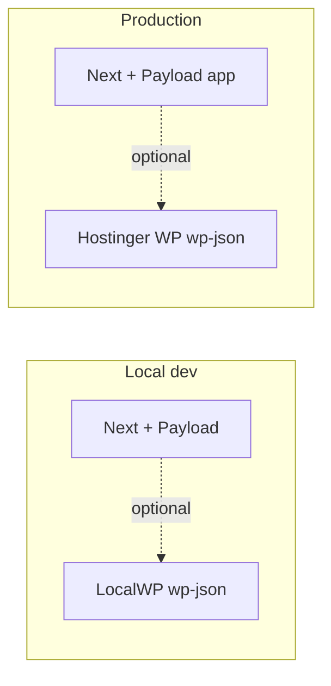

# Site plans — Next.js backend, CMS, and data

Reference doc for choosing and implementing how the MSC Next site (`MyStudioChannel`) connects to a database, admin panel, and signup flows. Last updated for review alongside [Development.md](./Development.md), [ReCall.md](./ReCall.md), and [Restore-Points.md](./Restore-Points.md).

---

## Original goals (summary)

- Next.js marketing site at **`https://mystudiochannel.com`** — **current `MyStudioChannel` ships as a full Next.js + Payload app** with persisted data (SQLite locally; Postgres recommended for production).
- **Simple admin** for copy, hero, Media, bookings, and leads is handled in **Payload** today.
- **Signups / verification** flows use Payload collections + Resend where wired.
- Comfortable with **WordPress**; **headless WordPress** remains an optional parallel track (see **Headless-WP-Backend-Plan.md**), not a requirement for the live MSC bundle.
- Traffic is modest (not millions of users).

---

## Critical constraint: static export vs full-stack Next (resolved)

**Current state:** The migration from **static export** to a **full Next.js + Payload** bundle is **complete**. **`output: 'export'` is not used.** Deploy with **`next build`** + upload **`.next`** + **`next start`** on the host (Hostinger Node app), same as **Development.md** / **HOSTINGER-DEPLOY.md**.

**Assets:** All site static images live under **`public/media`** and are addressed as **`/media/...`** (Payload **Media** + `npm run media:sync` / `npm run media:consolidate`). There is no parallel **`out/`**-only marketing deploy for this repo.

**Historical note:** Earlier experiments shipped only files from **`out/`**; that path conflicts with Payload admin, **`/api`**, and unified **`/media/`** hosting.

---

## Option comparison (short)

| Option | Admin / CMS | Typical DB | Fit with **current `MyStudioChannel` (Next + Payload, no `out/`)** | Notes |
|--------|-------------|------------|-----------------------------------------------------------|--------|
| **Headless WordPress** | WP Admin (familiar) | MySQL (often already on host) | **Optional add-on** — REST/GraphQL for extra flows or content if you split concerns | You already have WP **live on Hostinger** and **LocalWP** locally. Not required for the core MSC site today. |
| **Payload 3** (this repo) | Payload admin | SQLite locally; Postgres in prod | **Primary** — Node host required; see Development.md | Neon/Postgres recommended for production. |
| **Supabase** | Not a full marketing CMS by itself | Postgres | **Adjunct** — client SDK for auth/tables alongside Payload | Great for **auth / signups / tables** if you extend beyond Payload. |
| **Firebase** | Not WP-like CMS | Firestore etc. | **Adjunct** | Good for auth/notifications; Payload remains content/booking hub. |
| **Backblaze B2** | N/A | Object storage | N/A | **Files/backups**, not a replacement for CMS + structured app data. |

---

## Recommendation snapshot

- **Shipped path for MSC:** **Payload + Next** in one repo, **Node** on Hostinger, assets in **`/media/`** — see **HOSTINGER-DEPLOY.md** and **Go-Live-Checklist.md**.
- **Optional:** **headless WordPress** for WP-native content or endpoints (**Headless-WP-Backend-Plan.md**) if you want WP and Payload to coexist for different surfaces.
- **Signups / verification:** Payload **Leads** / **Bookings** + email adapters today; **Supabase** or WP endpoints remain optional if product needs grow.

---

## Headless WordPress — architecture (approved direction)

**Your setup:** WordPress **live on Hostinger** and **LocalWP** for local dev — ideal for dev → deploy of the same plugin/theme.

- **MSC core today:** booking and CMS content run through **Payload** (`/api/...`, admin **`/admin`**), not through **`out/`** static export.
- **If you add WP later:** browser `fetch` to `https://yoursite.com/wp-json/msc/v1/...` (CORS must allow the Next origin if cross-domain).
- **CMS content from WP:** optional **build-time** or runtime fetch; hero/marketing defaults and **Media** are already in Payload with assets under **`/media/`**.

### Planned WordPress side (Phase 1)

- Custom plugin (e.g. `msc-api`) registering namespace `msc/v1`:
  - `POST /booking-request` — persist booking (e.g. CPT `msc_booking`), optional `wp_mail` to admin.
  - `GET /booking-availability?date=YYYY-MM-DD` — return booked slots for the schedule UI.
  - `POST /signup` — persist lead (e.g. CPT `msc_lead`).
- **Security for public POSTs:** shared secret header (e.g. `X-MSC-Key`) vs option stored in WP; document in `.env` on Next side.

### Planned Next.js side (Phase 1)

- Extend [lib/booking.ts](../lib/booking.ts) — real `fetch` when `NEXT_PUBLIC_MSC_BOOKING_URL` is set; add availability fetch if needed.
- Add `lib/signup.ts` — POST to signup endpoint.
- **Env:** `NEXT_PUBLIC_MSC_*` URLs + server/client key handling as designed (see Development.md when wired).

### Phase 2 (optional CMS)

- ACF (or similar) field groups for hero, demos, testimonials; `lib/cms.ts` with **fallbacks** to current hardcoded content; rebuild to publish CMS changes.

---

## Payload — implemented (Phase A, current production architecture)

See [Development.md](./Development.md) for run commands, env, import map, and hydration notes.

**Done:** `withPayload`, `app/(payload)` routes, `app/(site)` marketing home, **`payload.config.ts`**, SQLite adapter, **`users`**, **`media`** (files on disk under **`public/media`**, URLs **`/media/...`**), **`bookings`**, **`leads`**; globals **`homepage`** (hero from Media) and **`site-settings`** (SEO). **`lib/booking.ts`** posts to **`/api/bookings`** when `NEXT_PUBLIC_MSC_BOOKING_URL=payload`. Marketing hero and metadata read from CMS when populated; otherwise built-in defaults. Admin includes a visible **Log out** nav link plus **`/admin/logout`**.

**You do next:** copy **`.env.example` → `.env.local`**, run **`npm run dev:payload`**, in **`/admin`** open **Site → Homepage**: pick images from **Media**, add hero slides; optional **Site settings** for title/tagline. Add files to **`public/media`** and run **`npm run media:sync`** when bulk-importing. Test **`/`** and booking flow.

**Phase B (production DB):** switch **`payload.config.ts`** to **`@payloadcms/db-postgres`** and Neon (or other Postgres) on the live host; lock down public **`bookings`** create (API key / rate limit).

---

## If you must return to static-only hosting

Remove Payload, restore **`output: 'export'`**, and use **headless WordPress** or a **separate** Payload instance the static site calls over HTTPS.

---

## MCP / tooling (Cursor)

**Canonical doc:** **[MCP-SETUP.md](./MCP-SETUP.md)** — global vs project **`mcp.json`**, env sync, archived servers.

| Layer | What |
|-------|------|
| **Global (8)** | GitHub, filesystem, Playwright, fetch, **tavily**, terminal-controller, sequential-thinking, desktop-commander — `~/.cursor/mcp.json` |
| **Project (6)** | **`local-wp`**, **`mcp-wordpress`**, `browsermcp`, `browserbase`, `21st-dev-magic`, `markdownify` — **`.cursor/mcp.json`** in repo |
| **Workspace** | **`user-payload`** (schema tools), Stripe/Vercel/Firebase plugins — **no JSON config** |

**Payload:** Do **not** use **`@govcraft/payload-cms-mcp`** locally (Redis + SSE; broken stdio). Use **`user-payload`**, REST, or admin.

**After `.env.local` changes:** **`npm run sync:mcp-env`** → reload MCP in Cursor.

**Not used for this project:** Postgres/Neon MCP (SQLite locally), duplicate browser MCPs (archived in **`.cursor/mcp.servers.archived.json`**).

---

## Related docs in this repo

| Doc | Description |
|---|---|
| [Development.md](./Development.md) | Stack, Payload, schedule dialog, booking env. |
| [MCP-SETUP.md](./MCP-SETUP.md) | Cursor MCP config and env sync. |
| [ReCall.md](./ReCall.md) | Session memory and checkpoints. |
| [Restore-Points.md](./Restore-Points.md) | Dated restore checkpoints and `payload.sqlite` backup. |
| [Run-Next-JS.md](./Run-Next-JS.md) | Build and serve commands. |

---

## Changelog

| Date | Note |
|------|------|
| 2026-05-30 | **Hostinger Migration:** Removed all references to Spaceship; updated to Hostinger (hPanel) deployment model. |
| 2026-05-29 | **MCP reorg:** Global trimmed to 7 servers; WordPress MCPs in project **`.cursor/mcp.json`**; **`npm run sync:mcp-env`**; **MCP-SETUP.md** documents Payload skip + **`user-payload`** workspace MCP. |
| 2026-04-11 | **Architecture lock-in:** Docs updated to state **full Next.js + Payload** bundle (no static **`out/`** deploy), unified static assets in **`public/media`** / **`/media/...`**, and **`media:sync` / `media:consolidate`** as the operational scripts. Option table and recommendations aligned with **START-HERE** source order. |
| 2026-04-08 | Created `Site-Plans.md` — consolidates backend/CMS options, static-export vs Payload, headless WP architecture, and phased plan for reference. |
| 2026-04-08 | **Payload Phase A** — integrated in-repo (`withPayload`, `(payload)` routes, SQLite, `bookings`, booking POST); static export removed. |
| 2026-04-08 | **Admin ops** — documented visible sidebar “Log out”, `/admin/logout`, import map path, and extension-related hydration troubleshooting (see Development.md). |
| 2026-04-08 | **Homepage in CMS** — globals for hero + site SEO; **Leads** collection; [Restore-Points.md](./Restore-Points.md) checkpoint **RP-2026-04-08-cms-globals**. |
| 2026-04-08 | **SEO expansion** — official SEO plugin enabled for `pages` and `hero-slides`; legacy `Homepage.heroSlides` rows now include a direct SEO group, and site metadata follows the active slide’s SEO values (including OG/Twitter image). |
