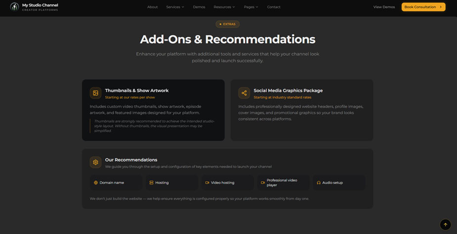
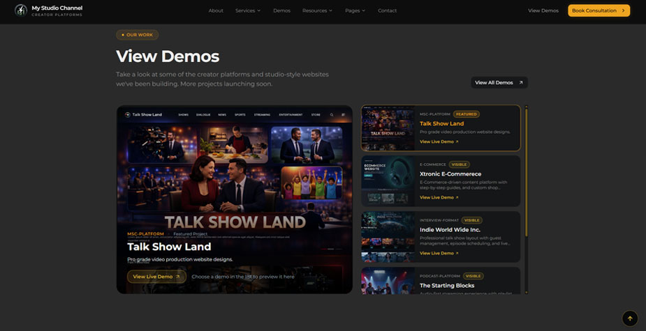

# My Studio Channel (MSC) — Next-Gen Creator Platforms

**The production-hardened development operating system for creator platforms.**  
**Build studio-style websites with a visual command center,** 
**Next.js 15 stability, and the custom MSC PRO ENGINE.**


[](https://nextjs.org/)
[](https://payloadcms.com/)
[](https://www.typescriptlang.org/)
[](https://tailwindcss.com/)
[](https://opensource.org/licenses/MIT)
[](https://cursor.com/)

---

## 📊 Current Status

| Metric              | Value                                                                  |
| ------------------- | ---------------------------------------------------------------------- |
| **Version**         | v2.0.0                                                                 |
| **Stack**           | Next.js 15 (React 19) + Payload CMS 3.81.0                             |
| **CMS Engine**      | ✅ MSC PRO ENGINE Studio Mode — Gold Sidebar + Dashboard               |
| **Deployment**      | ✅ Tiered FTPS (Hostinger/hPanel) via `PushItUP`                       |
| **Database**        | ✅ Local SQLite (Production-hardened)                                  |
| **Verified**        | ✅ `npm run verify:next` (Build Gate + Integrity)                      |
| **Status**          | 🟢 Production Ready                                                    |

---

## 🚀 Why My Studio Channel?

Most templates give you a website. **MSC gives you a complete media broadcasting operating system.**

| Capability                         | My Studio Channel | Typical Boilerplate |
| ---------------------------------- | ----------------- | ------------------- |
| Network-Style Layouts              | ✅                 | ❌                   |
| MSC PRO ENGINE (Custom CMS)        | ✅                 | ❌                   |
| Cinema-Quality Bento Grids         | ✅                 | ❌                   |
| Tiered FTPS Deploy Engine          | ✅                 | ❌                   |
| Zero Platform Fees (Ownership)     | ✅                 | ❌                   |
| Agent-Ready Documentation          | ✅                 | ❌                   |
| Hardened Production Verify Scripts | ✅                 | ❌                   |
| 16:9 Cinematic Design System       | ✅                 | ❌                   |

---

## 🖼️ Screenshots

### Built for Creators Like You

*Structured layouts for Podcasters, Content Creators, and Network Builders.*

### Dynamic Show Previews

*Integrated demo viewer with pro-grade video production website designs.*

### Add-Ons & Recommendations

*Complete platform guidance from domain setup to social media graphics packages.*

---

## 🚀 Quick Start

```bash
git clone https://github.com/jonbeatz/MyStudioChannel.git
cd MyStudioChannel
npm install                     # Install dependencies
copy .env.example .env.local    # Setup environment (Windows)
npm run dev:payload             # Start dev server on :3000
```

**Open `http://localhost:3000`** — The MSC portal.
**Admin `http://localhost:3000/admin`** — MSC PRO ENGINE Studio Mode.

Verify the baseline gate:
```bash
npm run verify:next             # clean · build · integrity check
```

> **Requirements:** Node 20.x+ · npm ≥ 10  
> **Secrets:** Live keys belong in `.env.local` only — never commit secrets.

> **Agent ritual:** Say `Begin project` in Cursor chat for full cold-start — see START-HERE.md.

---

## 🏗️ Architecture

```
My Studio Channel
├── MSC PRO ENGINE          # Custom Payload CMS admin experience
├── Frontend (port 3000)    # Next.js 15 App Router (React 19)
├── PushItUP Engine         # Tiered FTPS deployment automation
├── NovaMira Design         # High-end studio UI components
└── Jedi Tooling            # msc:* script system for ops
```

---

## 📦 Deployment Workflow

Optimized for **Hostinger (hPanel)** using our Tiered FTPS strategy:

- **Tier 1 (Branding):** `npm run pushitup:admin-branding` (CSS + Graphics)
- **Tier 2 (App):** `npm run pushit:live` (Full build, `.next`, Media)
- **Tier 3 (Config):** `npm run pushitup:server-config` (Package/Server files)

---

## 📚 Documentation

| Document                                           | Purpose                                           |
| -------------------------------------------------- | ------------------------------------------------- |
| [START-HERE.md](./.cursor/docs/START-HERE.md)     | Operator cold-start & source-of-truth order       |
| [Agent-Runbook.md](./.cursor/docs/Agent-Runbook.md) | Standardized prompts for consistent workflow       |
| [HOSTINGER-DEPLOY.md](./.cursor/docs/HOSTINGER-DEPLOY.md) | Production hosting playbook & recovery            |
| [Jedi-List.md](./.cursor/docs/Jedi-List.md)       | Command quick-reference for npm scripts           |
| [Restore-Points.md](./.cursor/docs/Restore-Points.md) | Milestone checkpoints & rollback instructions |

---

## 👥 Contributors

- **Jon Beatz** - Creator & Developer
  - GitHub: [@jonbeatz](https://github.com/jonbeatz)
  - Email: jonbeatz@gmail.com

---

## 📄 License

MIT © My Studio Channel

---

<p align="left">
  <sub>· Powered by the MSC Media Engine</sub>
</p>
